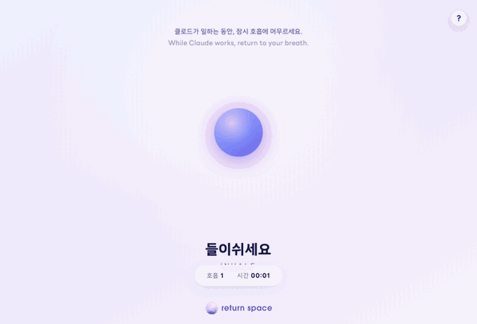

# return space

A mindful pause for developers who code with Claude.

When you hand a task to Claude, a singing bowl rings and a gentle breathing
companion opens in your browser. When Claude finishes, the bowl rings again to
call you back. Delegate, breathe, return.



## Install

Run these **one line at a time** (Claude Code reads a multi-line paste as a single
command):

```
/plugin marketplace add https://github.com/oasihani/return-space-for-claude
```
```
/plugin install return-space
```

The full `https://` URL above uses HTTPS, so it works even if you don't have a
GitHub SSH key set up.

That's it. The next time you give Claude a task, the breathing companion appears.

## How it works

It uses two Claude Code hooks:

- **UserPromptSubmit** (you start a task) → on every 8th prompt, ring the bowl +
  open `breathe.html`. The other prompts stay completely silent, so quick tasks
  aren't interrupted.
- **Stop** (Claude finishes) → ring the bowl, but only on the turns that opened
  the companion.

The breathing companion guides **box breathing** (inhale 4s · hold 4s · exhale 4s
· hold 4s) — a simple technique that calms the nervous system and restores focus.
A **countdown** shows the suggested length (1 minute); when it ends, or whenever
you feel done, press **Done** to finish.

## Requirements

- **macOS** and **Windows** work out of the box.
- **Linux** needs one of these for sound: `ffmpeg` (ffplay), `mpv`, `mpg123`,
  `vlc`, or PulseAudio (`paplay`). The breathing screen still opens without them.

## Customize

- **How often it opens** — defaults to once every **8** prompts. To change it,
  either edit `OPEN_EVERY` at the top of `scripts/hook.mjs`, or set the
  `RETURN_SPACE_EVERY` environment variable (e.g. `5` for more often, `12` for less).
- **Session length** — the countdown defaults to 1 minute. Edit `RECOMMENDED_SEC`
  near the bottom of `breathe.html` for a longer or shorter break.
- **Sound** — replace `sounds/singing-bowl.mp3` with your own.
- **Breathing pattern** — edit the `PHASES` array near the bottom of `breathe.html`.

## Credits

Made by [The Wellness Collective](https://returnspace.app) — a corporate
mindfulness company. Part of the Return Space family.

Typeface: **LINE Seed Sans KR** by LINE Corporation, used under the LINE Seed
Font License.

## License

MIT — see [LICENSE](LICENSE).
